---
format:
  revealjs:
    theme: [default, custom.scss]
    minimal: true
    slide-number: true
    auto-stretch: false
engine: knitr
fig-cap-location: top
---

## One theory, many models of habitat suitability {.custom-title visibility="uncounted"}

:::: {.authors}
Kenneth B. Vernon [Scientific Computing and Imaging Institute, University of Utah]{.affiliation}
::::

:::: {.github}
 `{r} format(Sys.Date(), "%Y-%m-%d")`

 [kbvernon/west-2026-habitat-suitability](https://github.com/kbvernon/west-2026-habitat-suitability)

 [Home - LCD Soundsystem](https://youtu.be/ETDCbQUYiAQ?si=5631bkt8O14pl4jS)
::::

## The Box model

::::: {.horizontal-card}
::: {.profile .circle}

:::

:::: {.text}
[All models are wrong but some are useful.]{.font-md}  
- [George Box]{.font-mono}  

::: {.fragment .fade-in fragment-index=2}
**Is the Box model of models right or wrong?**
:::
::::
:::::

::::: {.horizontal-card .fragment .fade-in fragment-index=0}
::: {.profile}

:::

:::: {.text}
[All Cretans are liars.]{.font-md}  
- [Epimenides of Crete]{.font-mono}

::: {.fragment .fade-in fragment-index=1}
**Is Epimenides telling the truth or lying?**
:::
::::
:::::

## Diagnosis

A more charitable interpretation would be that all [**statistical**]{.underline} 
models are wrong, meaning they come with some degree of uncertainty.

:::: {.fragment .fade-in style="margin-top: 1.5em;"}
**But there are other kinds of models...**
::::

## Models

Both of these are models:

:::: {#models layout="[47,-6,47]" style="margin: 1.5em 0;"}
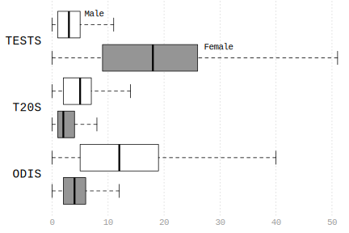

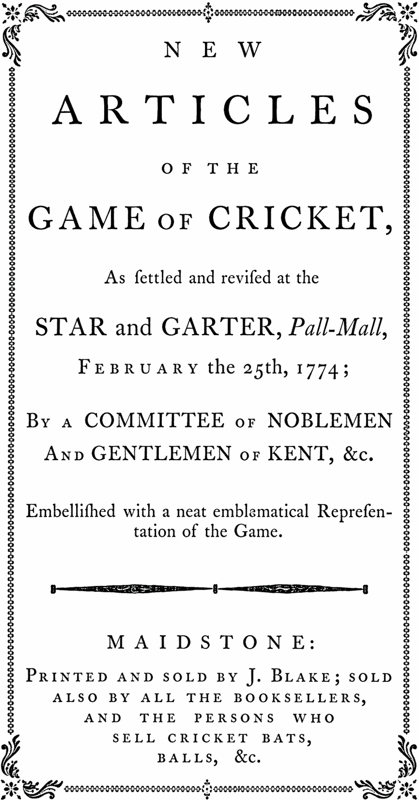{.fade-bottom}
::::

:::: {.fragment .fade-in .min-callout-note}
 [note:]{.title} Medians have probably wobbled 
a lot over the last 250 years, but there is a sense in which the rules are 
eternal...
::::

## Rulebooks

The Laws of Cricket are... 

:::: {.incremental}
- **True.** There may be disagreement about their precise content, but they 
  cannot be *systematically* wrong.  
- **General.** They apply to every game, even to backyard cricket where some 
  rules may be ignored.  
- **Necessary.** If something is to count as an instance of the game, then the
  rules *must* apply to it (again, even if some rules are broken).  
::::

## The Charnov model

:::: {.horizontal-card}
::: {.profile .circle}

:::

::: {.text}
[Optimality models are analogous to rulebooks for games.]{.font-md}  
- [Eric Charnov]{.font-mono}  
:::
::::

:::: {.fragment .fade-in .min-callout-note style="margin-top: 1.5em;"}
 [tbf:]{.title} Charnov never suggested the view
of rulebooks that I just offered...
::::

## Actual Quote

From Charnov and Orians (1973), unpublished monograph:

> Building optimality models requires at least two things — first, the choice of 
a *goal* (what is being optimized?), then the choice of the *game* that the 
organism will take part in. The game gives the constraints or rules within which 
the organism must operate.  

## Inference

We observe Simon hit a ball with a strange flat board...

:::: {.fragment .fade-in .chunk}
### INTERPRETATION:  
["Simon must be playing cricket."]{.description}  

We classify his action as a move in cricket.
::::

:::: {.fragment .fade-in .chunk}
### INFERENCE:  
["What are the Laws of Cricket again?"]{.description}

Our interpretation sets off a cascade of entailments:

::: {.incremental}
- Law 1: *The players*. A cricket team consists of eleven players, including a 
  captain...
- Law 16: *The result*. The side which scores the most runs wins the match...  
- Law 18: *Scoring runs*. Runs are scored when the two batters run to each 
  other's end of the pitch...  
:::
::::

## Explanation

Why did Simon hit the ball?

:::: {.fragment .fade-in .chunk}
### THE GOAL:  
["*Because* he wants his team to score more points."]{.description}  

What Aristotle called a *final cause*.
::::

:::: {.fragment .fade-in .chunk}
### THE RULE:  
["*Because* the ball was bowled to him."]{.description}  

Do not ask me to explain cricket batting strategies.
::::

:::: {.fragment .fade-in .chunk}
### THE GAME:  
["*Because* he is playing cricket."]{.description}  

Sometimes called *naive action explanation*.
::::

:::: {.fragment .fade-in .min-callout-note style="margin-top: 2em;"}
 [note:]{.title} In behavioral ecology, we are
typically concerned with rule-explanations involving descriptions of the
environment.
::::

## Principle of Charity

[SYNONYMS:]{.font-mono .font-muted} Adaptationism, Optimization Analysis, 
Rational Accommodation.

:::: {#accommodation}
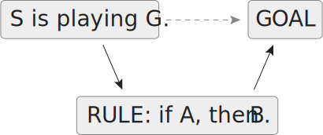
::::

When seeking to explain intentional behavior, we revise these descriptions until
we arrive at a set that makes what the agent does rational in its circumstances.

## Science

But enough with philosophical stage setting, let's get on with the science!

## Habitat selection

An organism must choose one habitat from a finite set of alternatives. 

:::: {.r-stack style="margin: 1.5em 0;"}
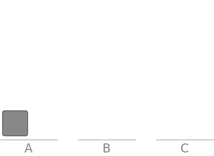

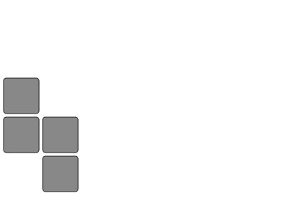{.fragment .fade-in fragment-index=1}

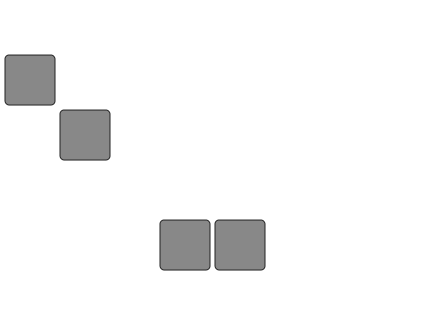{.fragment .fade-in fragment-index=2}

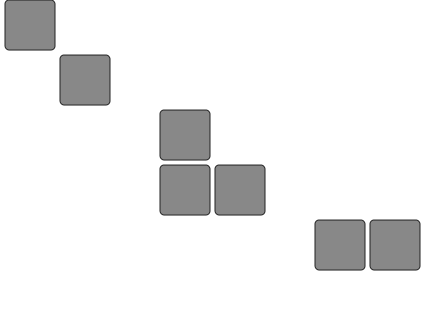{.fragment .fade-in fragment-index=3}
::::

[Over time, these decisions pile up.]{.fragment .fade-in fragment-index=1} 
[The result is a species distribution.]{.fragment .fade-in fragment-index=3}

## Two Models

of habitat selection...

:::: {#ifd style="margin-top: 1.5em;"}
[Optimality model]{.font-mono .font-muted}  

The [**Ideal Free Distribution**]{.underline} (IFD) defines general rules of 
habitat selection that structure individual decisions.  

::: {.fragment .fade-in .font-muted}
Reason forward **from utility to choice**.
:::
::::

:::: {#sdm style="margin-top: 1.5em;"}
[Statistical models]{.font-mono .font-muted}  

[**Species Distribution Models**]{.underline} (SDMs) describe the aggregate 
distributional effect of actual or observed habitat selection by individuals.  

::: {.fragment .fade-in .font-muted}
Reason backward **from choice to utility**.
:::
::::

## Ideal Free Distribution

Let $E_{i}$ be net energetic output of habitat $i \in 1, ..., K$ at density 
$n_{i}$.  

:::: {.fragment .fade-in .chunk}
### SUITABILITY:  
[$E_{i}/n_{i}$]{.description}  

The payoff to each individual is the average productivity.
::::

:::: {.fragment .fade-in .chunk}
### SELECTION RULE:
[$\text{choose } i^{*} = \arg\max_{i} \; E_{i}/n_{i}$]{.description}

An individual always prefers the habitat with the highest payoff.
::::

:::: {.fragment .fade-in .chunk}
### EQUILIBRIUM:  
[$E_{i}/n_{i} = E_{j}/n_{j} \;\; \forall_{i,j} \mid n_{i}, n_{j} > 0$]{.description}  

Individuals are indifferent when payoffs are equal across occupied habitats.
::::

:::: {.fragment .fade-in .chunk}
### IFD:  
[$(n_{1}, \dots, n_{K})$]{.description}  

The equilibrium implies a habitat distribution.
::::

## Habitat suitability

The baseline suitability $B_{i}$ with density-dependent effects $f_{i}(n_{i})$.

$$
E_{i}/n_{i} = B_{i} - f_{i}(n_{i})
$$

:::: {.fragment .fade-in .chunk}
### ENERGY:  
[$E_{i} = n_{i}(B_{i} - f_{i}(n_{i}))$]{.description}  

Net energy output, with $n_{i}B_{i}$ and $n_{i}f_{i}(n_{i})$ the aggregate 
output and cost.
::::

:::: {.fragment .fade-in .chunk}
### EXTERNALITY:  
[$f_{i}(n_{i}) = B_{i} - E_{i}/n_{i}$]{.description}  

The difference between the baseline and realized suitability, the average cost.
::::

## Density dependence

Let $AP = E/n$ and $MP = dE/dn$, then...

$$
AP - MP = n f'(n)
$$

with $n f'(n)$ being the total effect on the population of one more individual.

## Negative dependence
[Decreasing returns to scale:]{.font-muted} $MP < AP \iff f'(n) > 0$

:::: {.r-stack style="margin: 1.5em 0;"}
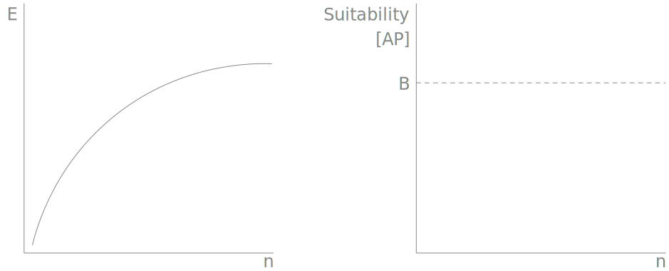

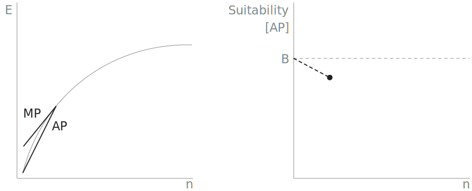{.fragment .fade-in-then-out fragment-index=1}
 
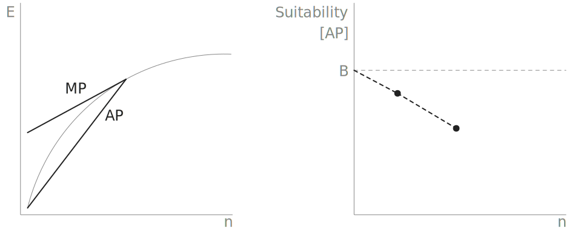{.fragment .fade-in-then-out fragment-index=2}

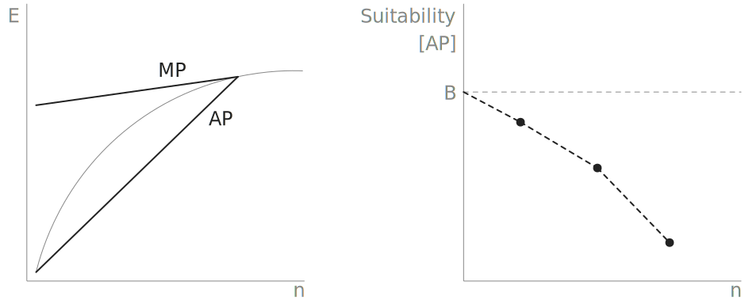{.fragment .fade-in fragment-index=3}
::::

## Positive dependence
[Increasing returns to scale:]{.font-muted} $MP > AP \iff f'(n) < 0$

:::: {.r-stack style="margin: 1.5em 0;"}
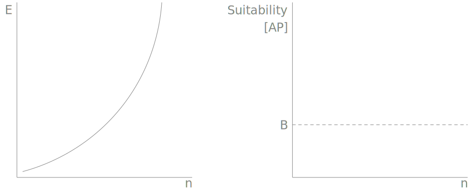

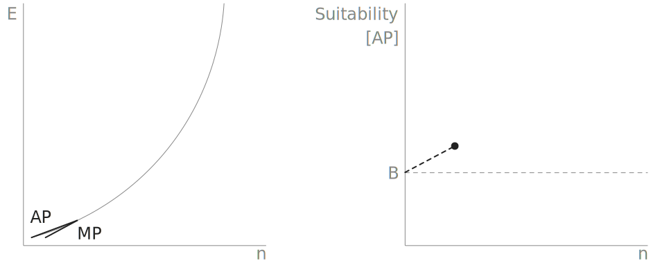{.fragment .fade-in-then-out fragment-index=1}

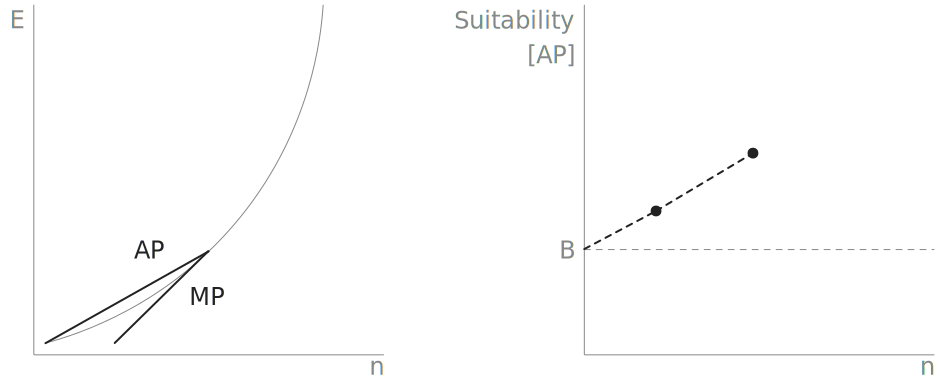{.fragment .fade-in-then-out fragment-index=2}

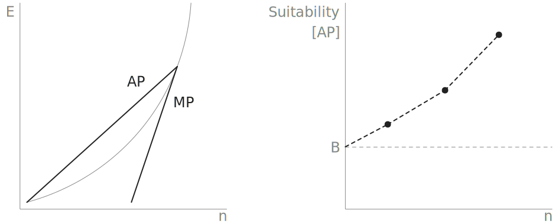{.fragment .fade-in fragment-index=3}
::::

## Input Matching

Let $N = \sum_{j} n_{j}$ and $Q = \sum_{j} E_{j}$ be the regional population and
energetic output, then equilibrium implies that

$$
\frac{n_{i}}{N} = \frac{E_{i}}{Q}
$$

The proportion of the population in a habitat will be equal to its contribution 
to regional production.

## Species Distribution Models

[GOAL:]{.font-muted .font-mono} Model how a population is distributed across a 
set of habitats:

$$
E\left[\frac{n_{i}}{N}\right] = p_{i}
$$

where $p_{i}$ is the expected share of the population in habitat $i$ and is a 
function of environmental characteristics:

$$
p_i = g(X_i), \quad \sum_{i} p_{i} = 1 
$$

:::: {.fragment .fade-in .min-callout-note style="margin-top: 2em;"}
 [note:]{.title} (i) These shares correspond to 
relative productivity, $E_{i}/Q$. (ii) You can use any kind of statistical model 
you want to estimate $g$.
::::

## Discrete habitats

For $K$ discrete habitats, each individual independently selects one habitat 
with probability $p_{1}, \dots, p_{K}$. Then  

$$
(n_{1}, \dots, n_{K}) \sim \mathrm{Multinomial}(N; p_{1}, \dots, p_{K})
$$

and

$$
E\left[\frac{n_{i}}{N}\right] = p_{i}
$$

$$
p = \textrm{softmax}(X\beta)
$$

:::: {.fragment .fade-in .min-callout-note style="margin-top: 2em;"}
 [note:]{.title} This is just one example of a
parametric model for discrete habitats.
::::

## Presence-only data

[CHALLENGE:]{.font-muted .font-mono} The species abundance, $N$, is rarely if 
ever known.

Less than ~6.5% of the Grand Staircase-Escalante National Monument has been 
subject to archaeological survey (as of 2020).

## Ambiguous preferences

[CHALLENGE:]{.font-muted .font-mono} Absolute measurements of habitat conditions 
are ambiguous.

:::: {.r-stack style="margin: 1.5em 0;"}
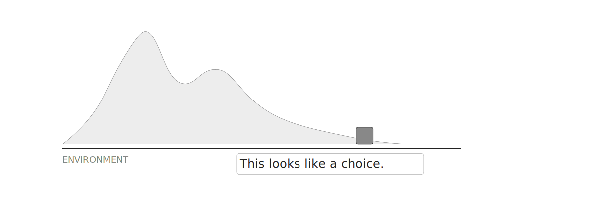

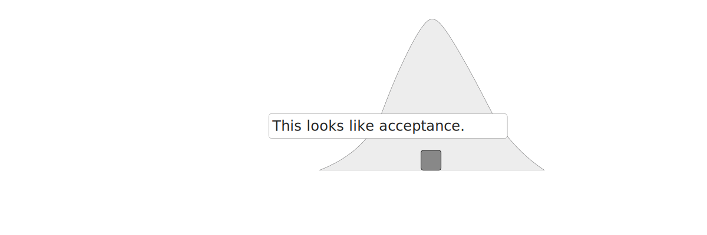{.fragment .fade-in}
::::

:::: {.fragment .fade-in}
It matters what the available alternatives are.
::::

## Different preferences

[CHALLENGE:]{.font-muted .font-mono} Species operate under different 
constraints.

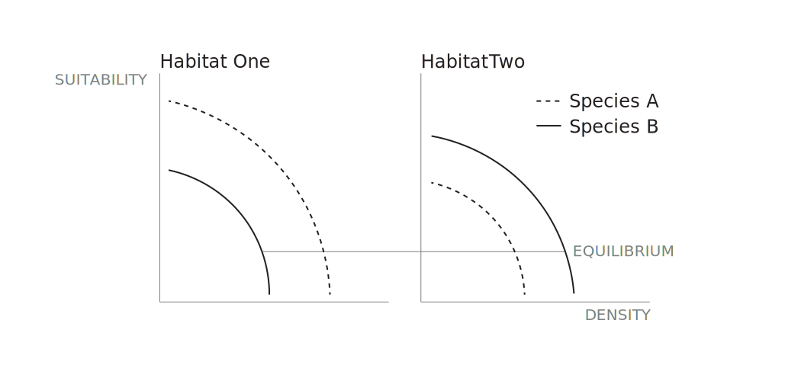

## Example

Archaeological populations of foragers and farmers in the GSENM.

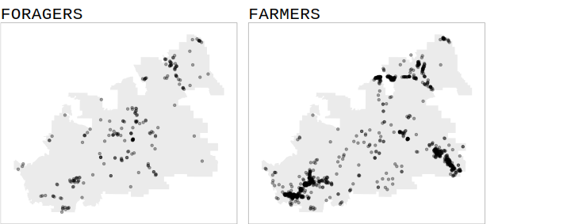

## Hand waving...

A popular way to handle these challenges is with a Poisson process model like 
MaxEnt.

:::: {.fragment .fade-in}
You type up some R code, run it, and...
::::

## Foragers and farmers

Variation in habitat preferences...

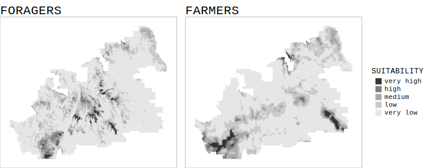

## But...

do species *always* choose their habitats?

:::: {.fragment .fade-in style="margin-top: 1.5em;"}
It is tempting to distinguish between Species Distribution and Habitat 
Suitability models, letting the former be merely correlative and leaving the 
latter to have the force of necessity implied by IFD rules.
::::

:::: {.fragment .fade-in style="margin-top: 1.5em;"}
I am fine with this view so as long as we accept that the moment we interpret
the behavior as habitat selection, the cascade of IFD entailments must 
inevitably follow.
::::

:::: {.fragment .fade-in style="margin-top: 1.5em;"}
If it was all mere correlation, intentional behavior would be incoherent, sort 
of like...
::::

## Calvinball

::: {style="margin: 1.5em 0;"}
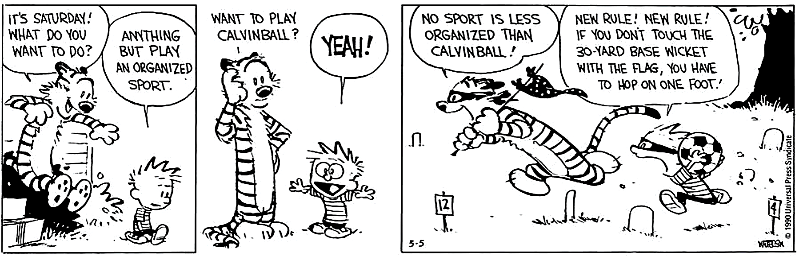
:::

## Acknowledgments

:::: {.columns}
::: {.column}
- Simon "Waldorf" Brewer
- Brian "Statler" Codding
:::

::: {.column}
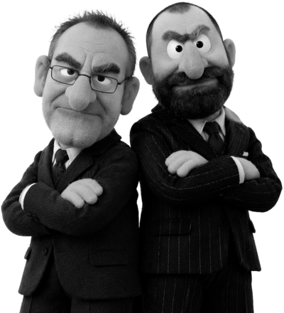{width="100%"}
:::
::::